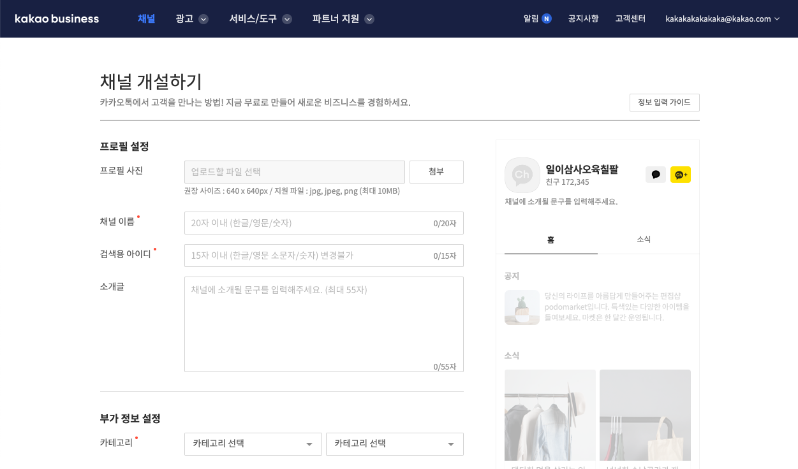
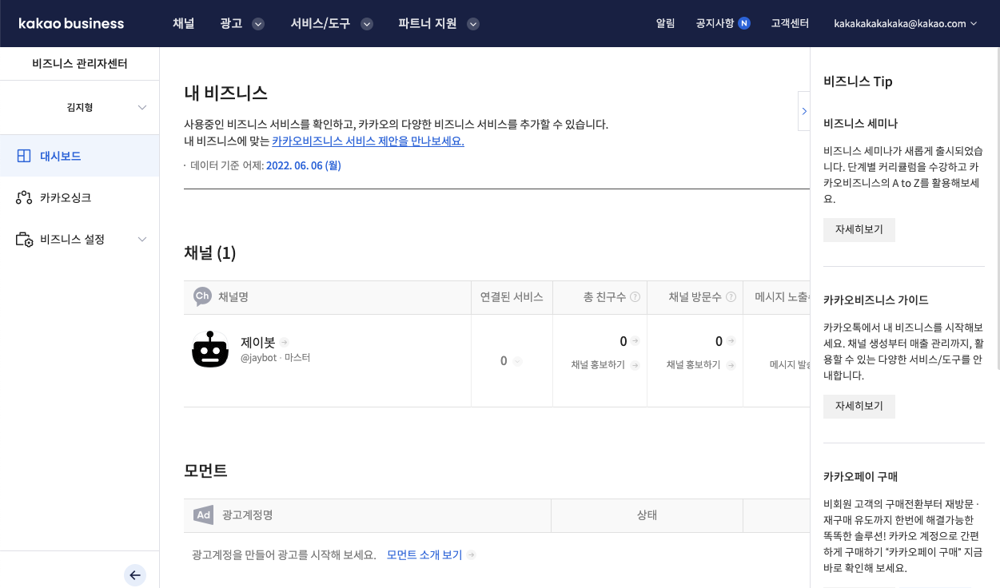
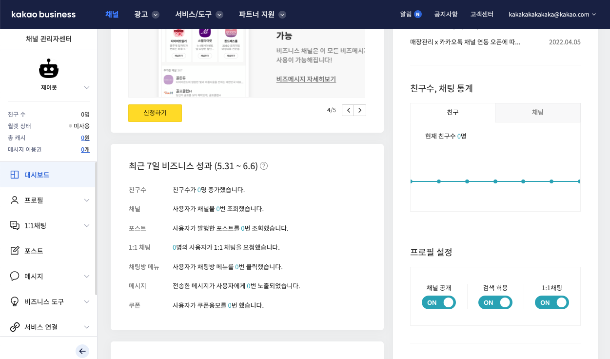
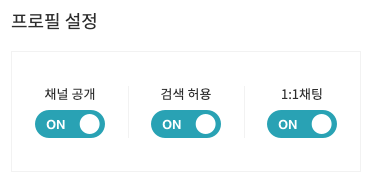
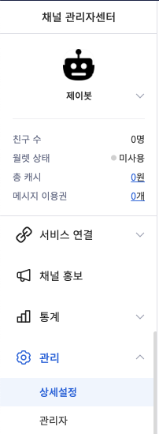
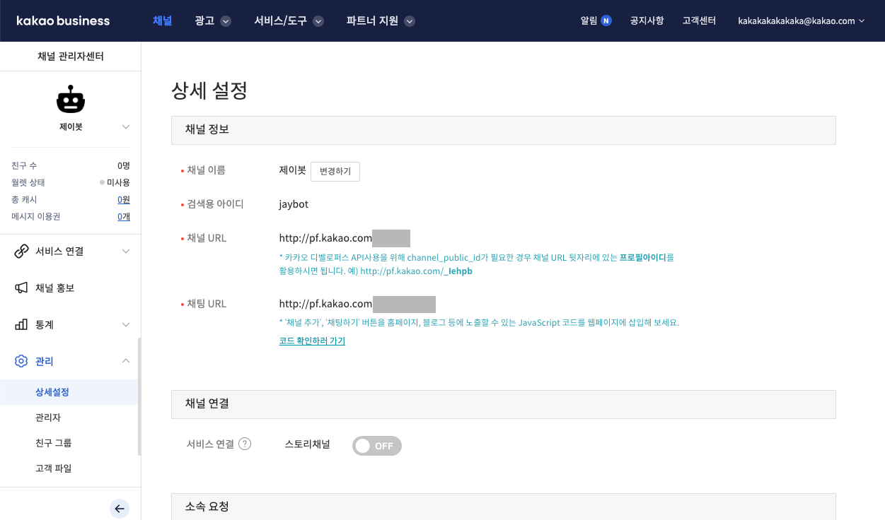
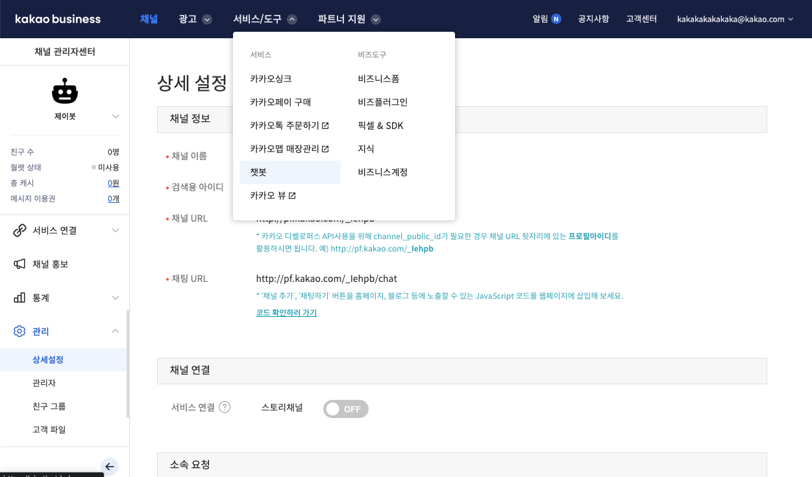
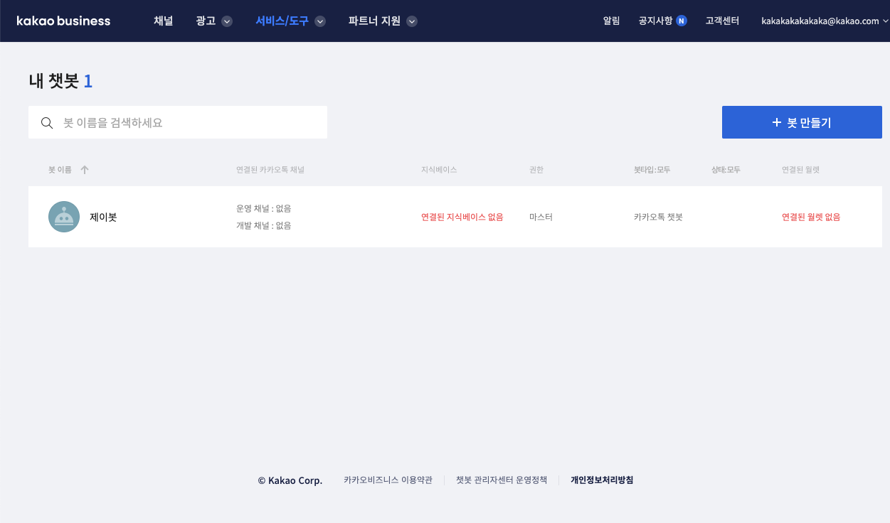

# Setting Kakao Business

## Overview

이 문서는 카카오톡 내 챗봇을 이용하기 위해 설정해주어야 하는 카카오 비즈니스 대시보드 설정에 관한 내용입니다.

## Steps

1. Kakao Business 계정 생성
1. 새 채널 개설하기
1. 프로필 설정 및 1:1 채팅 URL 확인
1. 챗봇 신청

### Kakao Business 계정 생성

- [business.kakao.com](https://business.kakao.com/) 접속합니다.
- 우측 상단 로그인 버튼을 눌러 본인 카카오 계정에 접속합니다.
- 카카오 비즈니스 계정을 추가로 만들라고 안내되고, 안내에 따라 계정 생성을 진행하면 됩니다.

### 새 채널 개설하기

- 새 채널 개설하기 버튼을 눌러 다음의 내용을 자세히 작성한 후 화면 하단 확인 버튼 클릭합니다.
- 채널 생성은 바로 이루어지나, 타인의 카카오톡 앱에서 본 채널 검색은 2~3일 뒤에 가능하다고 명시되어 있습니다.
- 생성된 채널을 클릭해 대시보드로 넘어갑니다.

### 프로필 설정 및 1:1 채팅 URL 확인

- 우측 하단 프로필 설정에서 채널 공개, 검색 허용, 1:1채팅을 모두 ON 해주세요.

- 좌측 메뉴 하단 > 관리 > 상세 설정을 들어가주세요.

- 상세 설정 > 채널 정보 > 채널 URL이 본 채널의 아이디에 해당되는 URL입니다. 복사해주세요.

### 챗봇 신청

- 최초 챗봇 신청 시 챗봇 신청 사유 및 관련 정보를 기입받는 양식이 표시됩니다.
- 챗봇 최초 신청 후 6일 이내에 등록 완료 알림이 카카오 이메일 계정에 표시됩니다. 그 이후부터 다음 과정을 진행할 수 있습니다.

